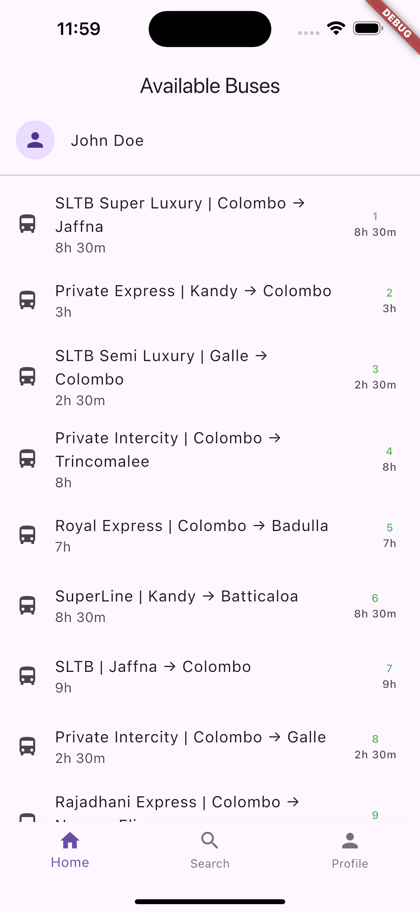
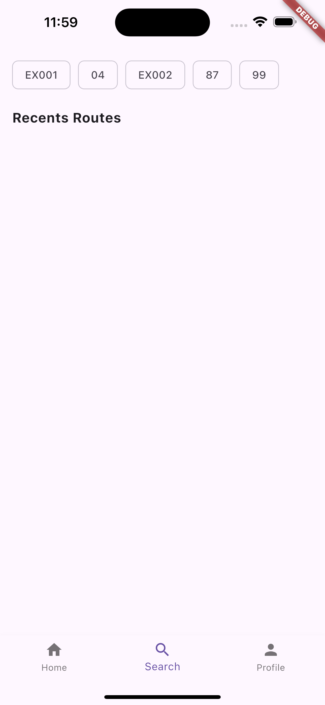
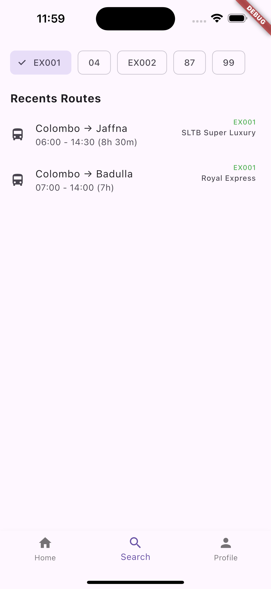

# 🚌 LankaBusRide

Lanka Bus Ride is a Flutter-based mobile application that allows users to view available bus routes across Sri Lanka. The app supports real-time route listing, filtering, user profile display, and search functionality.

---

## 📁 Project Structure

The project follows a clean layered architecture:

lib/
│
├── core/ # Common utilities, themes, constants
│
├── data/
│ ├── models/ # Data models for Bus, User
│ ├── datasources/ # Remote API data sources
│ └── repositories/ # Repository implementations
│
├── domain/
│ ├── entities/ # Core business models (Bus, User)
│ ├── repositories/ # Abstract repositories
│ └── usecases/ # Business logic for fetching data
│
├── presentation/
│ ├── blocs/ # BLoC logic and states/events
│ ├── pages/ # UI screens (Home, Search, Profile)
│ └── widgets/ # Reusable UI components
│
├── injection/ # Dependency injection setup
└── main.dart # App entry point

## 🧪 Architecture Pattern

This app uses:

✅ MVVM pattern
✅ BLoC state management
✅ Repository Pattern
✅ Clean Architecture Principles
✅ Dependency Injection (get_it)

---

## 🔍 ScreenShots

   

---
## 📱 Features

- View recent and top bus routes
- Filter buses by route number
- User profile display from API
- Clean and scalable MVVM + BLoC architecture
- Dependency Injection with `get_it`

---

## 🧪 Testing

Tests live under the `test/` folder.  

---

📦 API Services

Bus data: Mocky API
User data: Mocky API
APIs are consumed via ApiServiceImpl using the http package.

---

## 🛠️ Requirements

- Flutter SDK
- Android Studio
- Device or Emulator

---

## 📄 License

This project is licensed under the MIT License.

---

## 🙋‍♂️ Author

- Randika Wanninayaka ([@randikawann](https://github.com/randikawann))

